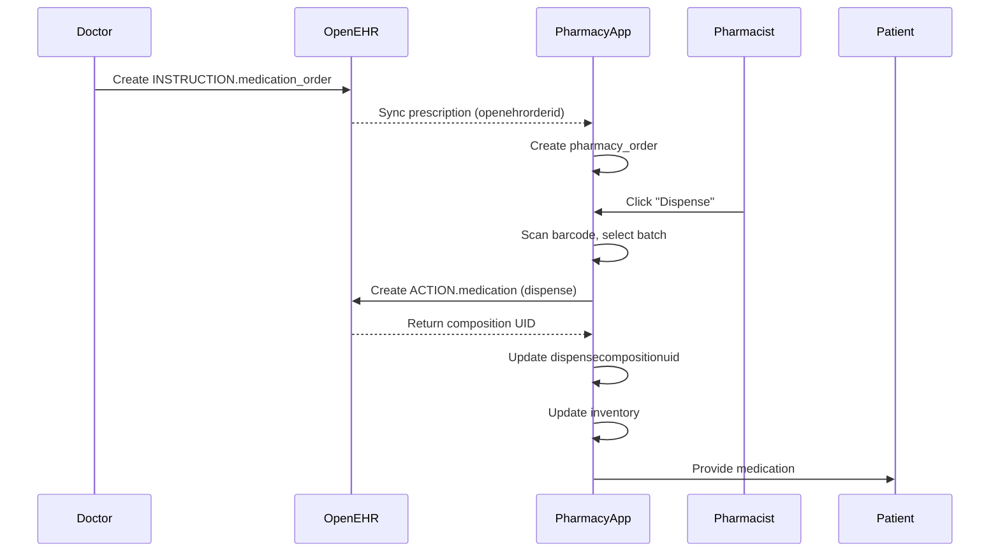

# Pharmacy-OpenEHR Integration Guide

Complete implementation guide for integrating the pharmacy application with OpenEHR for medication tracking, clinical safety, and audit trails.

## 🏗️ Architecture Overview

```
┌─────────────────────────────────────────────────────────────┐
│                         OpenEHR                              │
│  ┌──────────────────┐  ┌──────────────────┐  ┌────────────┐│
│  │ INSTRUCTION      │  │ ACTION           │  │ EVALUATION ││
│  │ medication_order │→ │ medication       │  │ medication ││
│  │                  │  │ (dispense event) │  │ summary    ││
│  └──────────────────┘  └──────────────────┘  └────────────┘│
└─────────────────────────────────────────────────────────────┘
                            ↕
┌─────────────────────────────────────────────────────────────┐
│                    Pharmacy Application                      │
│  ┌──────────────┐  ┌──────────────┐  ┌──────────────────┐  │
│  │ Drug Catalog │  │ Inventory    │  │ Pharmacy Orders  │  │
│  │ - Drugs      │  │ - Batches    │  │ - Order Items    │  │
│  │ - Batches    │  │ - Stock      │  │ - Dispensing     │  │
│  │ - Pricing    │  │ - Locations  │  │ - Billing        │  │
│  └──────────────┘  └──────────────┘  └──────────────────┘  │
└─────────────────────────────────────────────────────────────┘
```

## 📋 Implemented Features

### ✅ 1. Database Schema Updates

**File:** `lib/db/tables/pharmacy-orders.ts`

Added `dispensecompositionuid` field to track OpenEHR dispense events:

```typescript
export const pharmacyOrders = pgTable("pharmacy_orders", {
  orderid: uuid("orderid").primaryKey().defaultRandom(),
  openehrorderid: text("openehrorderid"),        // INSTRUCTION.medication_order UID
  dispensecompositionuid: text("dispensecompositionuid"), // ACTION.medication UID
  // ... other fields
});
```

**Migration:** `migrations/add-dispense-composition-uid.sql`

### ✅ 2. OpenEHR Templates Uploaded

**Templates:**
- `template_medication_dispense_v1` - For recording dispense events
- `template_medication_summary_v1` - For patient medication lists

**TypeScript Interfaces:**
- `lib/openehr/medication-dispense.ts`
- `lib/openehr/medication-summary.ts`

### ✅ 3. Medication Dispense API

**Endpoint:** `POST /api/d/[workspaceid]/pharmacy/orders/[orderid]/dispense`

**Flow:**
1. Pharmacist clicks "Dispense" in UI
2. API validates order and patient
3. Creates OpenEHR composition using `template_medication_dispense_v1`
4. Updates pharmacy order with `dispensecompositionuid`
5. Updates order items status to DISPENSED
6. Records batch number and expiry date

**Request Body:**
```json
{
  "items": [
    {
      "itemid": "uuid",
      "batchid": "uuid",
      "quantity": 21,
      "substituted": false,
      "substitutionReason": "",
      "notes": "Take with food",
      "barcode": "SCAN123"
    }
  ]
}
```

**Response:**
```json
{
  "success": true,
  "orderid": "uuid",
  "dispenseCompositionUids": ["composition-uid-1", "composition-uid-2"],
  "message": "Order dispensed successfully and recorded in OpenEHR"
}
```

### ✅ 4. Medication History API

**Endpoint:** `GET /api/d/[workspaceid]/patients/[patientid]/medications`

**Features:**
- Queries OpenEHR using AQL
- Returns complete medication timeline
- Groups events by medication
- Identifies active medications

**Response:**
```json
{
  "patientId": "uuid",
  "patientName": "John Doe",
  "nationalId": "123456789",
  "totalEvents": 15,
  "activeMedications": 3,
  "timeline": {
    "Amoxicillin 500mg": [
      {
        "time": "2025-03-10T14:30:00Z",
        "actionState": "Prescription dispensed",
        "route": "oral",
        "quantity": 21,
        "unit": "capsules",
        "batchNumber": "LOT-44532",
        "expiryDate": "2027-01-01",
        "composer": "Pharmacist John Smith"
      }
    ]
  },
  "events": [...]
}
```

## 🔧 Implementation Steps

### Step 1: Run Database Migration

```bash
# Apply the migration
psql $DATABASE_URL < migrations/add-dispense-composition-uid.sql
```

### Step 2: Verify Templates in OpenEHR

```bash
curl -H "X-API-Key: YOUR_KEY" \
     -H "Authorization: Basic YOUR_AUTH" \
     https://base.tibbna.com/ehrbase/rest/openehr/v1/definition/template/adl1.4
```

Should return:
- `template_medication_dispense_v1`
- `template_medication_summary_v1`

### Step 3: Update Pharmacy UI

**Add Dispense Button Handler:**

```typescript
async function handleDispense(orderId: string, items: DispenseItem[]) {
  const response = await fetch(
    `/api/d/${workspaceid}/pharmacy/orders/${orderId}/dispense`,
    {
      method: 'POST',
      headers: { 'Content-Type': 'application/json' },
      body: JSON.stringify({ items })
    }
  );
  
  if (response.ok) {
    const data = await response.json();
    console.log('Dispensed:', data.dispenseCompositionUids);
    // Refresh order list
  }
}
```

### Step 4: Display Medication History

```typescript
async function fetchMedicationHistory(patientId: string) {
  const response = await fetch(
    `/api/d/${workspaceid}/patients/${patientId}/medications`
  );
  
  const data = await response.json();
  return data.timeline;
}
```

## 🛡️ Clinical Safety Features (To Implement)

### 1. Drug Interaction Checking

**Table:** `drug_interactions`

```sql
CREATE TABLE drug_interactions (
  interactionid UUID PRIMARY KEY,
  drugid1 UUID REFERENCES drugs(drugid),
  drugid2 UUID REFERENCES drugs(drugid),
  severity TEXT, -- mild, moderate, severe
  description TEXT,
  recommendation TEXT
);
```

**Check Before Dispensing:**

```typescript
async function checkDrugInteractions(patientId: string, newDrugId: string) {
  // Get patient's current medications
  const currentMeds = await getCurrentMedications(patientId);
  
  // Check interactions
  const interactions = await db
    .select()
    .from(drugInteractions)
    .where(
      or(
        and(
          eq(drugInteractions.drugid1, newDrugId),
          inArray(drugInteractions.drugid2, currentMeds.map(m => m.drugid))
        ),
        and(
          eq(drugInteractions.drugid2, newDrugId),
          inArray(drugInteractions.drugid1, currentMeds.map(m => m.drugid))
        )
      )
    );
  
  return interactions;
}
```

### 2. Allergy Checking

**Use OpenEHR Archetype:** `openEHR-EHR-EVALUATION.adverse_reaction_risk.v1`

**AQL Query:**
```sql
SELECT
  a/data[at0001]/items[at0002]/value/value as substance,
  a/data[at0001]/items[at0009]/items[at0011]/value/value as reaction
FROM EHR e[ehr_id/value='${patientNationalId}']
CONTAINS COMPOSITION c
CONTAINS EVALUATION a[openEHR-EHR-EVALUATION.adverse_reaction_risk.v1]
```

**Block Dispensing:**
```typescript
if (patientAllergies.includes('Penicillin') && drug.category === 'Penicillin') {
  throw new Error('ALLERGY ALERT: Patient allergic to Penicillin');
}
```

### 3. Batch Tracking & Recalls

**When Dispensing:**
```typescript
await db.insert(pharmacyOrderItems).values({
  drugid,
  batchid,
  scannedbarcode: batch.barcode,
  // Store batch details
});

// Record in OpenEHR
compositionData['batch_number'] = batch.lotnumber;
compositionData['expiry_date'] = batch.expirydate;
```

**Drug Recall Query:**
```typescript
async function findAffectedPatients(batchNumber: string) {
  return await db
    .select({
      patient: patients,
      order: pharmacyOrders,
      item: pharmacyOrderItems,
    })
    .from(pharmacyOrderItems)
    .innerJoin(drugBatches, eq(pharmacyOrderItems.batchid, drugBatches.batchid))
    .innerJoin(pharmacyOrders, eq(pharmacyOrderItems.orderid, pharmacyOrders.orderid))
    .innerJoin(patients, eq(pharmacyOrders.patientid, patients.patientid))
    .where(eq(drugBatches.lotnumber, batchNumber));
}
```

## 📊 Medication Timeline UI Component

**File:** `components/pharmacy/MedicationTimeline.tsx`

```typescript
export function MedicationTimeline({ patientId }: { patientId: string }) {
  const [timeline, setTimeline] = useState<MedicationEvent[]>([]);

  useEffect(() => {
    fetch(`/api/d/${workspaceid}/patients/${patientId}/medications`)
      .then(res => res.json())
      .then(data => setTimeline(data.events));
  }, [patientId]);

  return (
    <div className="space-y-4">
      {timeline.map((event, index) => (
        <div key={index} className="flex items-start gap-4">
          <div className="flex-shrink-0 w-32 text-sm text-gray-500">
            {new Date(event.time).toLocaleString()}
          </div>
          <div className="flex-shrink-0">
            {event.actionState === 'Prescription issued' && <FileText className="w-5 h-5 text-blue-500" />}
            {event.actionState === 'Prescription dispensed' && <Package className="w-5 h-5 text-green-500" />}
            {event.actionState === 'Medication course completed' && <CheckCircle className="w-5 h-5 text-gray-500" />}
          </div>
          <div className="flex-1">
            <div className="font-medium">{event.medication_item}</div>
            <div className="text-sm text-gray-600">{event.actionState}</div>
            <div className="text-sm text-gray-500">
              {event.quantity} {event.unit} • Batch: {event.batch_number}
            </div>
          </div>
        </div>
      ))}
    </div>
  );
}
```

## 🔄 Complete Workflow

### Prescription → Dispense → Record



## 📝 API Endpoints Summary

| Endpoint | Method | Purpose |
|----------|--------|---------|
| `/api/d/[workspaceid]/pharmacy/orders/[orderid]/dispense` | POST | Dispense medication and record in OpenEHR |
| `/api/d/[workspaceid]/patients/[patientid]/medications` | GET | Get complete medication history |
| `/api/d/[workspaceid]/patients/[patientid]/prescriptions` | GET | Get prescriptions from OpenEHR |
| `/api/d/[workspaceid]/pharmacy/orders` | GET | List pharmacy orders |

## 🎯 Next Steps

1. **Implement Drug Interaction Checking**
   - Create `drug_interactions` table
   - Add interaction check before dispensing
   - Display warnings in UI

2. **Add Allergy Checking**
   - Query OpenEHR for patient allergies
   - Block dispensing if allergy detected
   - Show alert dialog

3. **Build Medication Timeline UI**
   - Create timeline component
   - Add to patient profile
   - Show icons for different events

4. **Implement Batch Tracking**
   - Barcode scanning integration
   - Automatic batch selection
   - Expiry date warnings

5. **Add Medication Summary Generation**
   - Auto-generate from orders + dispenses
   - Display current medications
   - Export to PDF

## 🔐 Security Considerations

- ✅ Role-based access (only pharmacists can dispense)
- ✅ Audit trail in OpenEHR
- ✅ Batch tracking for recalls
- ⚠️ TODO: Drug interaction alerts
- ⚠️ TODO: Allergy checking
- ⚠️ TODO: Controlled substance tracking

## 📚 References

- OpenEHR Templates: `/openehr/templates/`
- TypeScript Interfaces: `/lib/openehr/`
- API Routes: `/app/api/d/[workspaceid]/`
- Database Schema: `/lib/db/tables/pharmacy-*.ts`

---

**Last Updated:** March 11, 2026
**Status:** ✅ Core Integration Complete | ⚠️ Clinical Safety Pending
